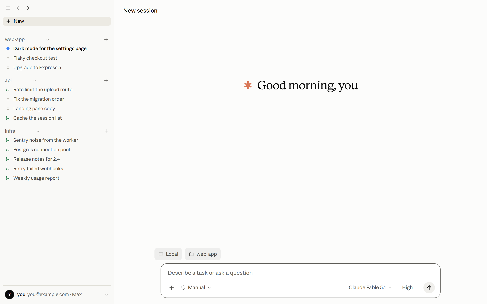
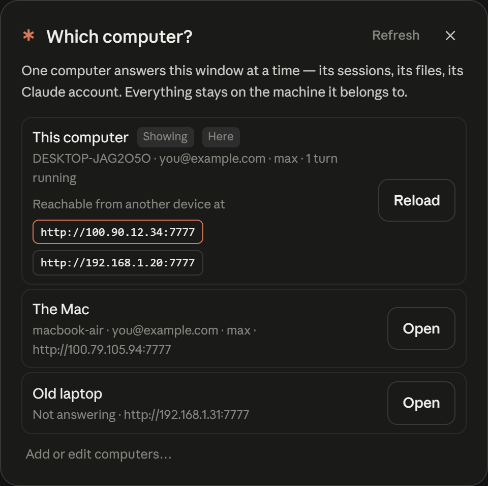
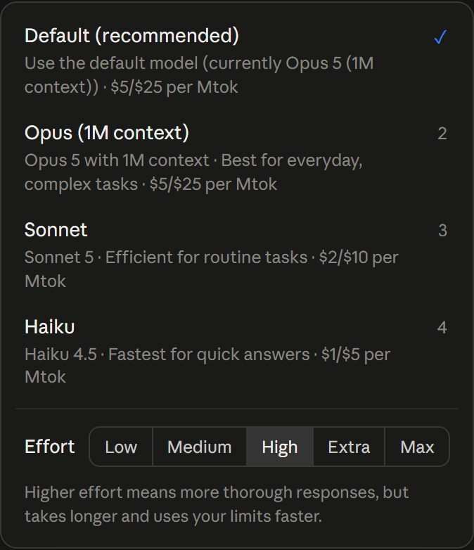
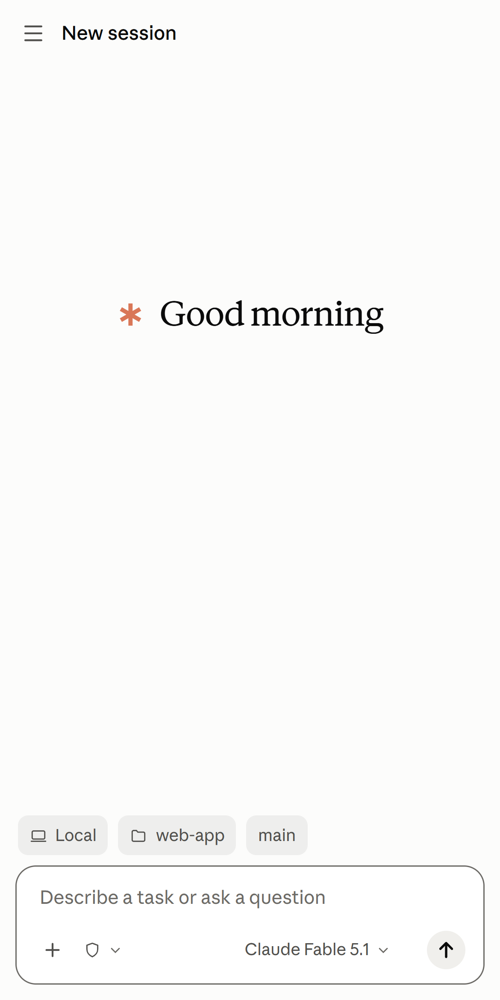

<div align="center">

# Claude Anywhere

**One set of sessions. Any of your Claude accounts. Your machine, not a relay.**

A self-hosted desktop app and web client for the Claude Code sessions already on
your computer. Switch which account answers — this machine's login, or a token
you paste from another — without leaving the session, and reach all of it from
your phone over your own network.

[](LICENSE)
[](#install)
[](https://docs.anthropic.com/en/docs/claude-code/sdk)



</div>

## What it is

Claude Code keeps every session as a transcript on your machine. This reads
those transcripts with the official [Claude Agent SDK][sdk], shows them in a
Claude-styled interface, and lets you continue any of them — which is exactly
what `claude --resume` does, so a session you start on your phone is the same
session your terminal picks up later.

## Why this exists

Claude Desktop is good, and it can already reach your machine from elsewhere
through Remote Control. Three things sent me here anyway.

**One session, whichever account you like.** Desktop is signed in as one
account. Here there are two, side by side: this computer's `claude login`, and a
token you paste — `claude setup-token` output from any other account, or a
Console key. You switch between them from the sidebar at any moment, and the
sessions do not care: the same conversation, the same files, answered by
whichever account you picked, billed to that account's plan. If you have a
personal subscription and a work one, or someone hands you a token for an
afternoon, this is the difference between one tool and two.

**No relay in the middle.** Desktop's Remote Control goes through
`claude.ai/code`, and an organisation policy can switch it off. Here your phone
opens a port on your own machine over Tailscale or your LAN. Nothing passes
through anyone else's service, there is no extra sign-in, and it keeps working
on a network that cannot reach a hosted one.

**It is yours.** MIT, no build step, one JavaScript file for the whole client.
When something is wrong for the way you work, you change it — and several things
in here exist because Desktop does not do them: a sidebar that never re-sorts
itself, per-task Stop for background commands and subagents, Rewind on any
earlier message, and a dev-server preview that reaches your phone.

| | Claude Desktop | Claude Anywhere |
|---|---|---|
| Accounts | one, signed in | two at once: this machine's login and a pasted token, switchable mid-session |
| Reaching your machine | Remote Control, through `claude.ai/code` | direct, over Tailscale or your own LAN |
| Turned off by an org policy | possible | nothing to turn off |
| Where your code goes | stays on the machine | stays on the machine, and there is no server of ours |
| Source | closed | MIT, ~4,000 lines you can read and change |
| Sidebar order | sorts itself | yours, by drag and drop |
| Preview of your dev server | yes, on that machine | yes, and on your phone |
| Per-session git worktrees | yes | yes |
| Panes: terminal, split view | yes | not yet |
| macOS and Linux app | yes | yes, unsigned so far |
| Support | Anthropic | an issue tracker and me |

**They are not rivals.** This reads and writes the same transcripts as
`claude --resume`, the VS Code extension and Desktop itself, so a session you
start in one you can pick up in another — and while another window is mid-turn
on a session, this one follows along and shows what it is doing.

## Highlights

- **Two accounts, one set of sessions**: this computer's `claude login` and a
  token you paste, switched from the sidebar whenever you like. Plan usage is
  shown for whichever one is answering.
- **One app, either computer**: run Claude here, or point the same window at
  another machine running Claude Anywhere and drive that one — its sessions, its
  files, its dev servers. No separate client, and nothing to install on the
  machine you are sitting at beyond the app itself. The window always says which
  machine is answering, and *Which computer?* lists them with what each one is
  doing, the address to type on your phone, and the Claude account it is signed
  in with.

<div align="center"></div>

- **Every session, every project** in one sidebar, in an order you set by drag
  and drop and that nothing re-sorts behind your back.
- **Live turns**: streaming text and thinking, tool calls with their input and
  result, a status line, queued messages that reach Claude at the next tool
  boundary rather than at the end of the turn.
- **The model menu is the CLI's own**: the models Claude Code offers this
  account, with its descriptions and prices, and the effort levels each model
  actually takes — Low, Medium, **High**, Extra, Max — rather than a list kept
  here that drifts. Haiku has none, so it shows none.

<div align="center"></div>

- **Permission prompts from the phone** — Allow, Allow always, Deny. A question
  from Claude arrives as a question: its options, a box for an answer that is
  not on the list, and the card collapses to what you chose.
- **Deleting is undoable**: a deleted session goes to a trash folder and comes
  back from *Deleted sessions*; only emptying the trash removes anything.
- **Tasks panel**: every command, subagent and workflow the turn is running,
  with elapsed time, live output and its own Stop; send one to the background
  and let Claude carry on.
- **Changes panel**: every file that differs from `HEAD`, with per-file diffs.
- **Preview**: the project's dev server inside the app, proxied so your phone
  can see a server that only listens on the PC — hot reload included.
- **Rewind to here** on any earlier message: a fork of the session up to just
  before it, with the message back in the composer to change and resend.
- **Watches your other windows**: a session being worked on in VS Code, a
  terminal or Claude Desktop streams in here as that window writes it.
- **Native app on all three**: the webview the machine already has, a few
  megabytes, tray icon, start with the machine, system notifications. Windows
  draws its own title bar; macOS and Linux keep theirs.
- **It updates itself, both ways**: every merge to `main` is built and published
  by GitHub Actions, and the app notices within the hour. The banner offers the
  file for the device you are holding **and** an *Update DESKTOP-…* button that
  tells the computer you are driving to fetch and install its own — the half you
  cannot do by tapping Download on a phone.
- **Restart the server or rebuild the app from anywhere**, including mid-turn:
  the server is a separate process, so the chat survives its own window closing.

See [docs/features.md](docs/features.md) for the whole list with the detail.

## Install

### From a release

Download from [Releases][releases]: a `.exe` for Windows, a `.dmg` for macOS
(one file, both chips), a `.deb` for Linux. It brings its own
Claude Code binary, so the `claude` CLI is not required — but [Node.js][node]
20 or newer must be installed and on `PATH`, because the app runs the server
with it.

The macOS build is not signed yet, so the first launch needs right-click → Open.

Every release is built and published by GitHub Actions when a change lands on
`main`, so what is on that page is what the code is. The app checks it once an
hour and offers the new one in a banner — the version and the commit it was built
from are in *Connectors & plugins → App*.

Two apps can be out of date at once, and they are different files: the one in
your hands and the one on the computer you are driving. The banner knows the
difference. **Download** takes the build for the device you are on;
**Update DESKTOP-…** tells that computer to fetch its own installer, close its
window, install and come back — so a phone can update the PC it is driving.

### From source

```bash
git clone https://github.com/aryasadeghy/claude-anywhere
cd claude-anywhere
npm install
npm start                    # http://127.0.0.1:7777
```

That is the web app on its own — enough for a phone, a Mac, or another browser
on the same machine. For the native window you also need the
[Rust toolchain][rust] and the Tauri CLI
(`cargo install tauri-cli --version "^2"`). On Linux, the WebKitGTK development
packages as well:

```bash
npm run desktop              # run it as a native window
npm run dist                 # build the installer for this platform into src-tauri/target/release/bundle
```

New here? [docs/getting-started.md](docs/getting-started.md) walks the whole
thing, including the phone.

## From your phone



The server listens on `127.0.0.1` by default, so start by giving your devices a
private path to it. **Tailscale is the recommended one**:

```bash
tailscale serve --bg 7777
```

Then open the machine's Tailscale URL on the phone and add it to the home
screen — it is a PWA, so it gets its own icon and window.

> [!WARNING]
> This app runs Claude Code as you, on your machine. Anything that can reach it
> can read your files and run commands. Do not put it on the open internet, and
> set `REMOTE_PASSWORD` before binding it to a network you do not control.
> [SECURITY.md](SECURITY.md) has the short version of the threat model.

## How it works

```
  phone / Mac / browser ─┐
                         ├── http ──► server.mjs (Express, your machine)
  native window (Tauri) ─┘                 │
                                           ├── @anthropic-ai/claude-agent-sdk
                                           │      └── Claude Code ──► Anthropic
                                           └── ~/.claude/projects/*.jsonl
                                                  (the same transcripts the CLI writes)
```

- `server.mjs` — HTTP API, session list, live event streams.
- `lib/runs.mjs` — one Claude Code process per live turn, streaming input so a
  message typed mid-turn is folded in at the next tool boundary.
- `lib/tail.mjs` — follows transcripts other windows are writing.
- `public/` — the client. No build step, no framework: HTML, CSS and one JS
  file you can read.
- `src-tauri/` — the native shell (Rust): window, tray, notifications.

[docs/architecture.md](docs/architecture.md) goes deeper, including the SDK
behaviours that are easy to get wrong.

## Roadmap

Near term, in the order they are likely to happen:

- [x] Sidebar filters: group by date or state, show archived, sort.
- [x] A file browser, and search inside transcripts.
- [x] Keyboard shortcuts and a command palette (⌘K), for the Mac browser.
- [x] The PR bar's monitoring: CI failures, review comments, auto-merge.
- [x] Per-session git worktrees, and *Keep computer awake*.
- [x] macOS and Linux shells, so the native window is not Windows-only.
- [x] Releases built and published by CI, and an app that offers them — to the
      device you are holding, and to the computer you are driving.
- [ ] Preview tools for Claude: the previewed page's console, network errors
      and DOM, so it can fix what it is looking at.
- [ ] Terminal pane and split view.

Bigger, and deliberately further out:

- [ ] **Other providers.** Keep one conversation and change who answers it:
      add an OpenAI or Google account alongside your Claude one and continue
      the same session on GPT or Gemini, with the same files and the same
      tools. The transcript format and the tool protocol are Claude Code's, so
      this needs a translation layer rather than a switch — it is an intention,
      not a promise, and it will land behind a flag first.

Ideas and arguments about the order belong in
[Discussions](https://github.com/aryasadeghy/claude-anywhere/discussions).

## Contributing

Issues and pull requests are welcome — see [CONTRIBUTING.md](CONTRIBUTING.md)
for how to run it, what the house style is, and what a PR needs (a screenshot,
if it changes anything you can see). [CLAUDE.md](CLAUDE.md) is the same set of
rules written for Claude Code itself, so an agent working in this repo starts
out knowing them.

## Star history

<a href="https://star-history.com/#aryasadeghy/claude-anywhere&Date">
  
</a>

## Not affiliated with Anthropic

This is a community project. It is not made, endorsed or supported by
Anthropic. "Claude" and "Claude Code" are Anthropic's trademarks, used here
only to say what this tool works with. Your use of Claude through it is your
own Claude account, under Anthropic's terms.

## Licence

[MIT](LICENSE) © Arya Sadeghi

[sdk]: https://docs.anthropic.com/en/docs/claude-code/sdk
[releases]: https://github.com/aryasadeghy/claude-anywhere/releases
[node]: https://nodejs.org/
[rust]: https://rustup.rs/
